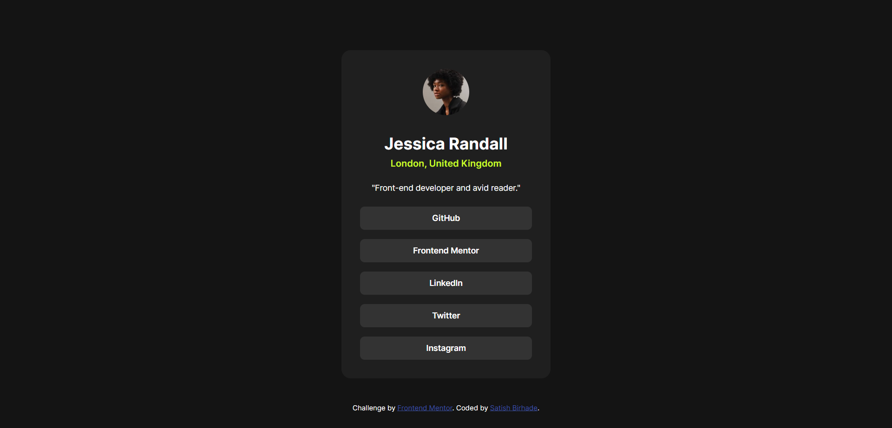
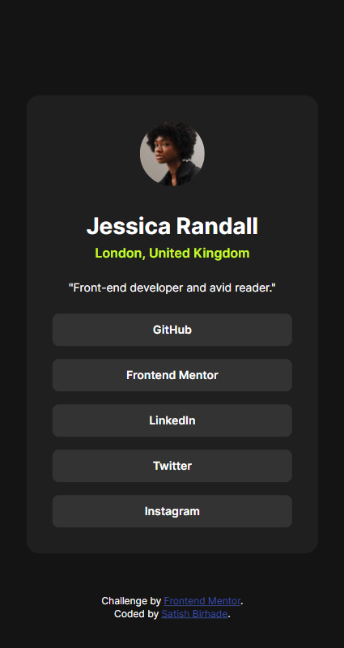

# Frontend Mentor - Social links profile solution

This is a solution to the [Social links profile challenge on Frontend Mentor](https://www.frontendmentor.io/challenges/social-links-profile-UG32l9m6dQ). Frontend Mentor challenges help you improve your coding skills by building realistic projects. 

## Table of contents

- [Frontend Mentor - Social links profile solution](#frontend-mentor---social-links-profile-solution)
  - [Table of contents](#table-of-contents)
  - [Overview](#overview)
    - [The challenge](#the-challenge)
    - [Screenshot](#screenshot)
      - [Desktop View](#desktop-view)
      - [Mobile View](#mobile-view)
    - [Links](#links)
  - [My process](#my-process)
    - [Built with](#built-with)
    - [What I learned](#what-i-learned)
    - [Useful resources](#useful-resources)
  - [Author](#author)

**Note: Delete this note and update the table of contents based on what sections you keep.**

## Overview

### The challenge

Users should be able to:

- See hover and focus states for all interactive elements on the page

### Screenshot

#### Desktop View


#### Mobile View


### Links

- Solution URL: [https://github.com/SatishB15/Social-Links-Profile](https://github.com/SatishB15/Social-Links-Profile)
- Live Site URL: [https://social-links-profile-sigma-lake.vercel.app](https://social-links-profile-sigma-lake.vercel.app/)

## My process

### Built with

- Semantic HTML5 markup
- CSS custom properties
- Flexbox
- CSS Grid
- Mobile-first workflow

### What I learned

Use this section to recap over some of your major learnings while working through this project. Writing these out and providing code samples of areas you want to highlight is a great way to reinforce your own knowledge.

```html
<h1>Some HTML code I'm proud of</h1>
<ul>
          <li><a class="social-link" href="https://github.com/SatishB15" target="_blank" rel="noopener">GitHub</a></li>
          <li><a class="social-link" href="https://www.frontendmentor.io/profile/SatishB15" target="_blank" rel="noopener">Frontend Mentor</a></li>
          <li><a class="social-link" href="https://www.linkedin.com/in/satish-birhade/" target="_blank" rel="noopener">LinkedIn</a></li>
          <li><a class="social-link" href="https://x.com/BirhadeSatish" target="_blank" rel="noopener">Twitter</a></li>
          <li><a class="social-link" href="https://www.instagram.com/satish_p_birhade" target="_blank" rel="noopener">Instagram</a></li>
        </ul>
```
```css
.proud-of-this-css {
    text-decoration: none;
    height: 2.5rem;
    border-radius: 0.5rem;
    color: var(--color-white);
    font-weight: 600;
    background-color: var(--color-grey);
    display: flex;
    align-items: center;
    justify-content: center;
}
```

### Useful resources

- [HTML](https://www.w3schools.com/html/) - The resources on HTML provided by W3Schools were instrumental in helping me understand the structure and semantics of web pages. I particularly appreciated the clear explanations and practical examples, which I will continue to use in future projects.
- [CSS](https://www.w3schools.com/css/) - The comprehensive guide on CSS by W3Schools significantly enhanced my understanding of styling and layout. The detailed tutorials and examples made it easier to grasp complex concepts, and I highly recommend it to anyone looking to improve their CSS skills.

## Author

- Frontend Mentor - [@SatishB15](https://www.frontendmentor.io/profile/SatishB15)
- Twitter - [@BirhadeSatish](https://x.com/BirhadeSatish)
- LinkedIn - [Satish Birhade](www.linkedin.com/in/satish-birhade)
